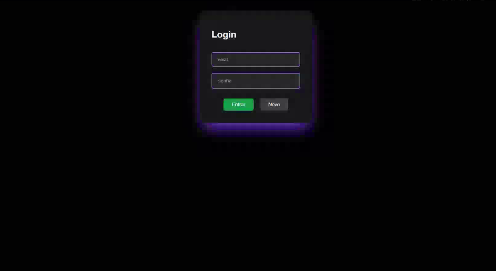

### Projeto Revisão Next 15 whitch ShadCN-UI

#### Page Login

🔐 Página de Login — Next.js + Tailwind CSS

Interface moderna de Login, construída com Next.js (App Router) e Tailwind CSS, focada em design clean, responsividade e boa experiência do utilizador.

✨ Visão Geral

Este projeto apresenta uma página de login simples e elegante, ideal para:

Sistemas web

Dashboards administrativos

Aplicações SaaS

Projetos de estudo ou produção

O layout utiliza cores escuras com destaque em violeta e verde, criando um visual moderno e profissional.

🎨 Design & UI

🌙 Tema escuro (Dark UI)

🎯 Formulário centralizado

🟣 Destaques em violeta

🟢 Botão de ação principal em verde

📱 Totalmente responsivo (mobile & desktop)

💎 Bordas arredondadas e sombras suaves

🧠 Tecnologias Utilizadas

Next.js 13+ (App Router)

React

Tailwind CSS

next/link para navegação SPA

CSS Utility-first

📄 Estrutura do Componente
Login()
 ┣ Formulário
 ┃ ┣ Input Email
 ┃ ┣ Input Senha
 ┃ ┣ Botão Entrar
 ┃ ┗ Botão Novo
 ┗ Navegação com Link (Next.js)

🧪 Funcionalidades Atuais

✅ Campos de email e senha

✅ Botão Entrar

✅ Botão Novo utilizador

✅ Navegação com next/link

⚠️ (Ainda sem validação ou autenticação real)

▶️ Como Executar o Projeto
1️⃣ Instalar dependências
npm install

2️⃣ Iniciar servidor de desenvolvimento
npm run dev

3️⃣ Abrir no navegador
http://localhost:3000/login

🚀 Possíveis Melhorias Futuras

🔒 Integração com autenticação (NextAuth / Firebase)

✅ Validação de formulário (Zod / React Hook Form)

🔁 Feedback de erro e loading

🌐 Integração com API

👤 Página de cadastro real

🔐 Proteção de rotas

👨‍💻 Autor

Desenvolvido por Emerson Sabino
Full Stack Developer

🚀 React | Next.js | Tailwind | TypeScript
